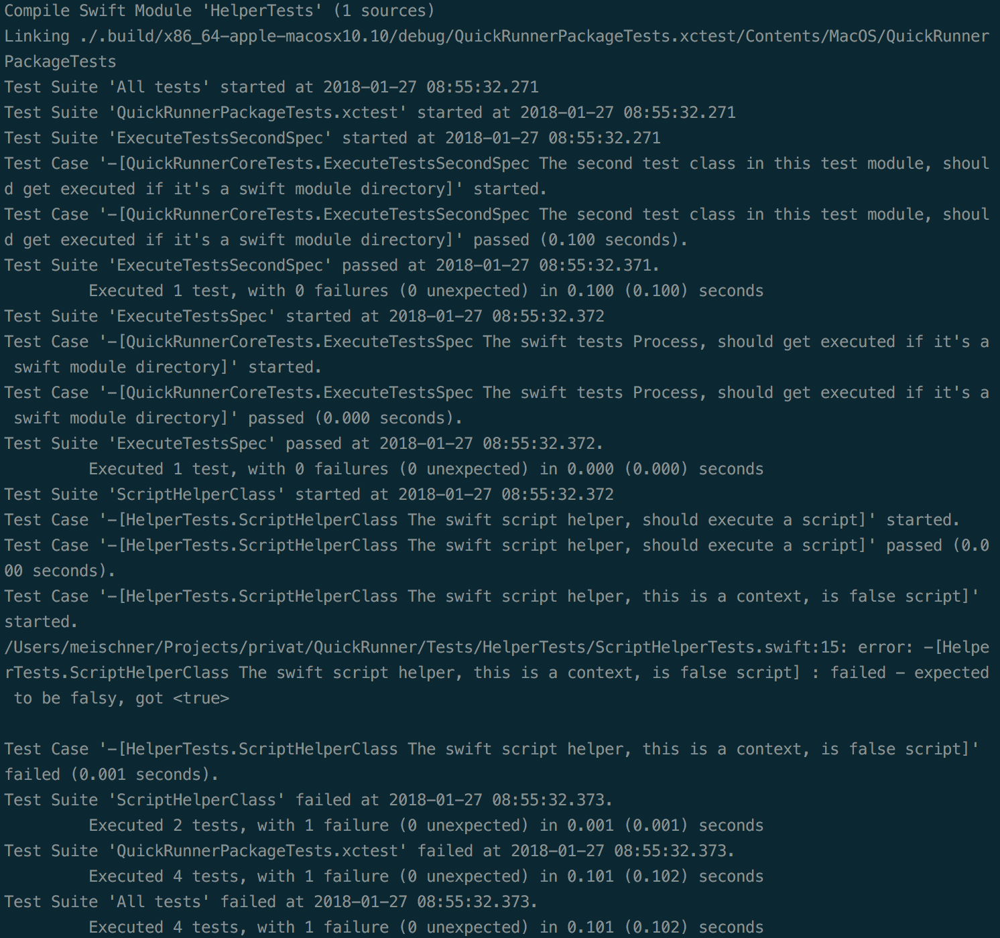
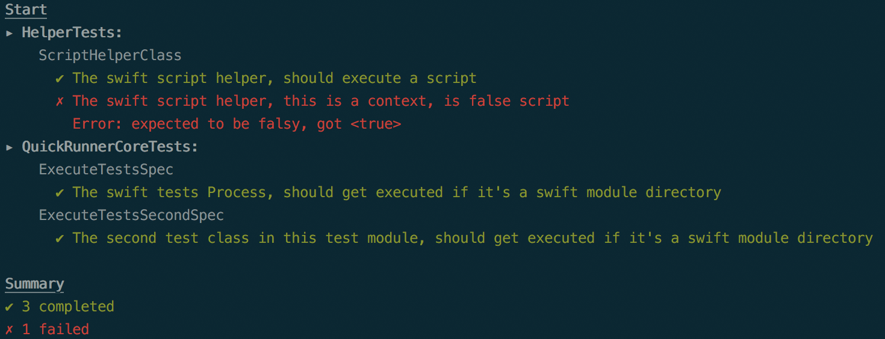

# QuickRunner

QuickRunner is a swift package to run Test with
the *Quick* package on command line.

QuickRunner is in early development.

## What it does
The normal `swift test` execution creates an unclear confusing console output.



The QuickRunner module tries to create a more clear and readable test output, inspired by [karma mocha reporter](https://github.com/litixsoft/karma-mocha-reporter).



## Project Preparation
To use Quick as testing framework for your project
it has to be configured correctly.

```swift
// swift-tools-version:4.0

import PackageDescription

let package = Package(
    name: "YourProject",
    dependencies: [
        .package(url: "https://github.com/Quick/Quick.git", from: "1.2.0"),
        .package(url: "https://github.com/Quick/Nimble.git", from: "7.0.3")
    ],
    targets: [
        // Targets are the basic building blocks of a package. A target can define a module or a test suite.
        // Targets can depend on other targets in this package, and on products in packages which this package depends on.
        .target(
            name: "YourProject",
            dependencies: [""]),
        .testTarget(
            name: "YourProjectTests",
            dependencies: ["YourProject", "Quick", "Nimble"])
    ]
)
```

Then you can use the libraries as usual.

## Installation
Clone the Repository

```shell
git clone https://github.com/jmeischner/QuickRunner.git
```

Then change in the new *QuickRunner* directory and execute `./install.sh`.

## Options

Until now only one option exists.

### Path

With

```shell
QuickRunner --path /path/to/your/swift/module
```

you can specify the path.

**Default**: `.`

